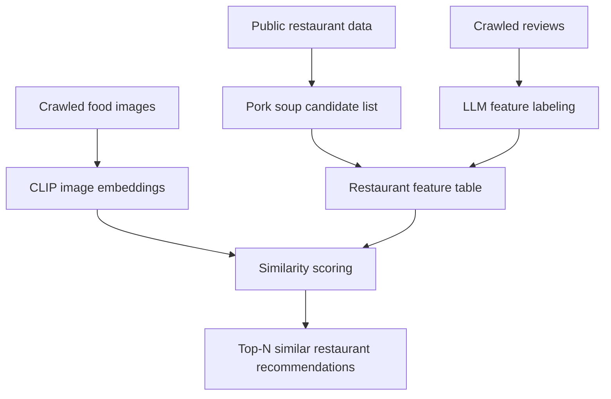
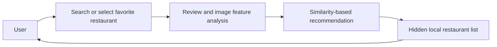

# 밥;도 (Bap;do)

> 부산 공공데이터와 리뷰/이미지 분석을 결합한 돼지국밥 맛집 추천 프로젝트<br>
> 2025 부산광역시 공공빅데이터 활용 창업경진대회

## Overview

밥;도는 부산의 대표 음식인 **돼지국밥**을 중심으로, 공공데이터와 네이버 리뷰/음식 이미지를 분석해 유명 맛집과 유사한 숨은 맛집을 추천하는 서비스 기획 및 데이터 분석 프로젝트입니다.

핵심 아이디어는 단순 평점 기반 추천이 아니라, 리뷰에서 드러나는 음식점의 특징과 음식 사진의 시각적 유사도를 함께 반영하는 것입니다.

## Key Features

- 부산 공공데이터 기반 음식점 후보군 구축
- 네이버 블로그/스마트스토어 리뷰 크롤링 및 수집 현황 관리
- Gemini API와 LangChain 기반 돼지국밥 특징 라벨링
- CLIP 임베딩 기반 국밥 이미지 유사도 계산
- 텍스트 특징과 이미지 특징을 결합한 유사 맛집 추천 파이프라인
- 서비스 화면, 대시보드, Figma 시안으로 사용자 경험 구체화

## Tech Stack

| Area | Tools |
| --- | --- |
| Data Collection | Python, Selenium, BeautifulSoup |
| Data Processing | Pandas, Polars |
| NLP / Labeling | LangChain, Gemini API |
| Vision | CLIP, image embeddings |
| Recommendation | Cosine Similarity, FAISS |
| Design | Figma, dashboard mockups |

## Repository Structure

```text
.
├── data/
│   ├── raw/          # 부산 공공데이터 원본 CSV
│   ├── processed/    # 전처리, 라벨링, 수집 현황 결과 CSV
│   └── reviews/      # 크롤링한 블로그 리뷰 CSV
├── notebooks/        # 수집, 전처리, 라벨링, 이미지 유사도 분석 노트북
├── reports/          # 서비스 화면 및 분석 결과 이미지
├── LICENSE
└── README.md
```

## Data

이 repo에는 GitHub에서 확인하기 적절한 크기의 CSV 데이터만 포함했습니다.

- `data/raw`: 부산 음식점, 관광, 축제, 전시 등 공공데이터 원본
- `data/processed`: 돼지국밥 후보군, 유명 가게 목록, 라벨링 결과, 수집 현황
- `data/reviews`: 유명 가게 및 전체 후보 가게의 블로그 리뷰 크롤링 결과

크롤링 이미지 원본과 정제 이미지는 약 761MB 규모라 GitHub 일반 repo에는 포함하지 않았습니다. 대신 이미지 수집/정제/유사도 분석 과정은 `notebooks/`에 보존했습니다.

자세한 파일 목록은 [data/README.md](data/README.md)를 참고하세요.

## Notebook Workflow

| Step | Notebook | Description |
| --- | --- | --- |
| 1 | `bapdo-pork-soup-list.ipynb` | 공공데이터 기반 돼지국밥 음식점 후보군 생성 |
| 2 | `bapdo-review-crawling.ipynb` | 네이버 블로그 리뷰 수집 |
| 3 | `bapdo-review-langchain.ipynb` | 리뷰 기반 음식점 특징 라벨링 |
| 4 | `bapdo-review-summarizer.ipynb` | 리뷰 요약 및 라벨링 실험 |
| 5 | `bapdo-image-crawling.ipynb` | 음식점 이미지 수집 |
| 6 | `bapdo-image-similarity.ipynb` | CLIP 기반 이미지 유사도 분석 |
| 7 | `bapdo-naver-smartstore.ipynb` | 네이버 스마트스토어 리뷰 수집 실험 |

## Setup

```powershell
pip install -r requirements.txt
```

Gemini API를 사용하는 노트북은 실행 전에 환경변수를 설정해야 합니다.

```powershell
$env:GOOGLE_API_KEY="your-api-key"
```

## Recommendation Pipeline



## Service Flow



## Demo Screens

<p align="center">
  
  
  
</p>

[Figma 시안 보기](https://www.figma.com/design/J18MP1ViHTA5qKEUTFFIEt/Untitled?node-id=0-1&p=f&t=TBIj4cpfDHfGXVAY-0)

## My Contribution

- 부산 공공데이터 기반 음식점 후보군 수집 및 전처리
- 네이버 리뷰/이미지 크롤링 파이프라인 구성
- Gemini API와 LangChain을 활용한 돼지국밥 특징 라벨링
- CLIP 기반 국밥 이미지 유사도 분석
- 추천 서비스 UX 흐름, 화면 설계, 데이터 산출물 정리

## Team

김태연, 박민규, 이은재, 홍예원
