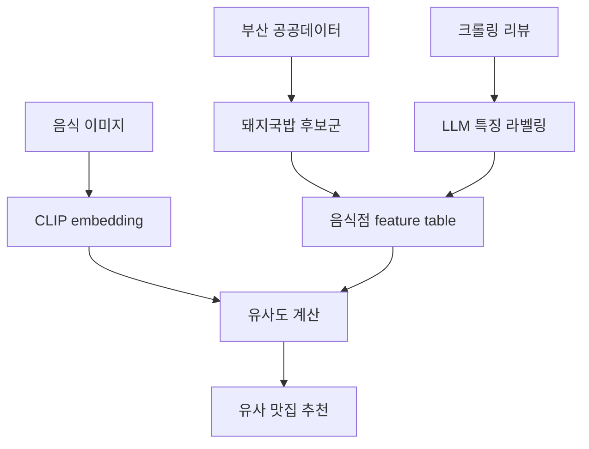
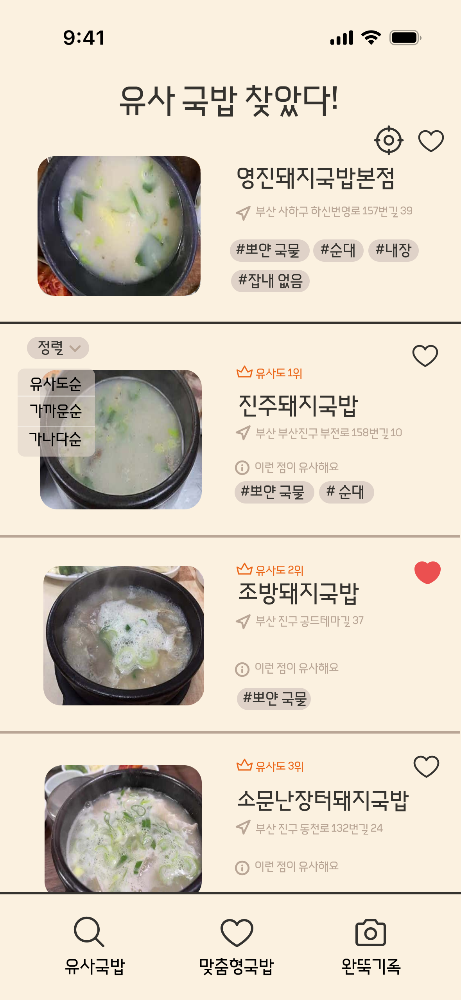
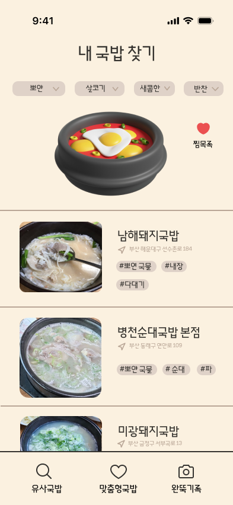
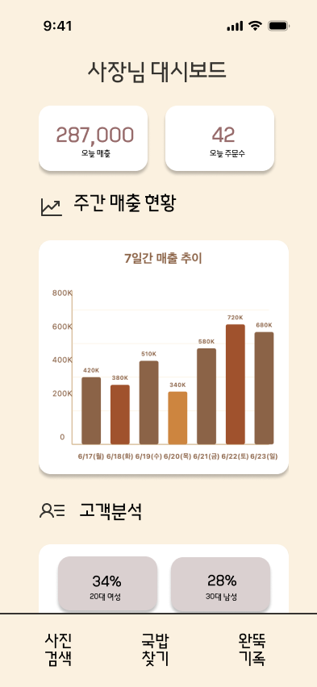

# 밥;도 - 부산 돼지국밥 맛집 추천

> 부산 공공데이터, 리뷰 텍스트, 음식 이미지 유사도를 결합해 유명 맛집과 비슷한 숨은 돼지국밥집을 추천하는 데이터 서비스 프로젝트입니다.

[](requirements.txt)
[](notebooks)
[](notebooks)
[](data/README.md)

## 개요

밥;도는 부산의 대표 음식인 돼지국밥을 중심으로, 공공데이터와 네이버 리뷰/음식 이미지를 분석해 유명 맛집과 유사한 숨은 맛집을 추천하는 서비스 기획 및 데이터 분석 프로젝트입니다.

단순 평점 기반 추천이 아니라, 리뷰에서 드러나는 음식점 특징과 음식 사진의 시각적 유사도를 함께 사용해 “내가 좋아한 국밥집과 비슷한 가게”를 찾는 흐름을 설계했습니다.

## 빠른 검토 경로

| 먼저 볼 것 | 확인할 내용 |
| --- | --- |
| [data/README.md](data/README.md) | 공개 데이터와 제외 데이터의 범위 |
| [notebooks/README.md](notebooks/README.md) | 수집, 라벨링, 이미지 유사도 분석 흐름 |
| [reports/](reports/) | 서비스 화면, 대시보드, 결과 이미지 |
| [requirements.txt](requirements.txt) | 실행 환경 |

## 문제 정의

부산을 방문하거나 지역 맛집을 찾는 사용자는 이미 유명한 가게 위주의 정보에 노출되기 쉽습니다. 이 프로젝트는 공공데이터로 후보 음식점을 만들고, 리뷰 텍스트와 이미지 유사도를 결합해 유명 맛집과 비슷한 숨은 가게를 찾는 추천 흐름을 제안했습니다.

## 내 역할

팀 프로젝트 산출물이며, 이 저장소는 단독 제작물로 소개하지 않습니다. 공개 가능한 기여 범위는 다음과 같습니다.

- 부산 공공데이터 기반 돼지국밥 음식점 후보군 수집/전처리
- 네이버 리뷰와 이미지 크롤링 pipeline 구성
- Gemini API와 LangChain 기반 리뷰 특징 라벨링
- CLIP embedding 기반 국밥 이미지 유사도 분석
- 추천 서비스 UX 흐름과 화면 산출물 정리
- raw/crawled data와 대용량 이미지 자료의 공개 제외 처리

## 기술적 의사결정

| 영역 | 선택 | 이유 |
| --- | --- | --- |
| 후보군 구성 | 부산 공공데이터 | 지역성과 공신력 있는 초기 음식점 pool을 만들기 위함입니다. |
| 리뷰 분석 | Gemini API, LangChain | 리뷰에서 맛, 양, 분위기, 웨이팅 등 특징을 구조화하기 위함입니다. |
| 이미지 분석 | CLIP embedding | 음식 사진의 시각적 유사도를 텍스트 feature와 함께 활용하기 위함입니다. |
| 추천 | Cosine similarity, FAISS | 유명 맛집과 유사한 후보를 빠르게 찾기 위한 구성입니다. |
| 공개 정책 | small sample / docs 중심 | 리뷰와 이미지 크롤링 데이터의 재배포 리스크를 줄이기 위함입니다. |

## 추천 파이프라인



## 데모 화면

<p align="center">
  
  
  
</p>

[Figma 시안 보기](https://www.figma.com/design/J18MP1ViHTA5qKEUTFFIEt/Untitled?node-id=0-1&p=f&t=TBIj4cpfDHfGXVAY-0)

## 재현 가능성

```powershell
pip install -r requirements.txt
$env:GOOGLE_API_KEY="your-api-key"
```

Gemini API를 사용하는 notebook은 환경 변수가 필요합니다. API key는 코드나 notebook에 직접 저장하지 않습니다.

공개 checkout에서는 notebook 흐름과 reports 산출물을 검토할 수 있습니다. raw review, raw image, 대용량 crawling result는 공개하지 않습니다.

## 공개/비공개 경계

포함:

- 공공데이터 기반 후보군과 일부 작은 processed data
- notebook workflow
- 서비스 화면과 dashboard 이미지

제외:

- 대용량 크롤링 이미지와 정제 이미지
- 재배포 권한이 불명확한 raw review CSV
- API key, 제출 서류, 개인정보 가능 문서

## 한계

- 추천 결과는 크롤링 시점과 리뷰 수집 범위에 영향을 받습니다.
- 리뷰/이미지 데이터의 재배포 권한을 항상 별도로 확인해야 합니다.
- 서비스 구현은 PoC/기획 단계이며 production app은 포함되어 있지 않습니다.
